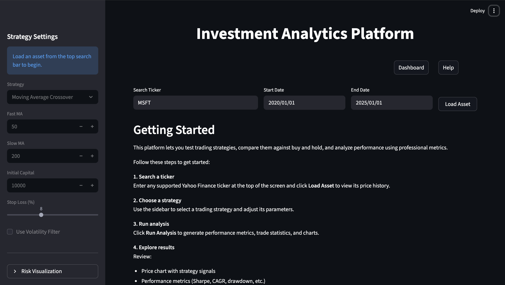
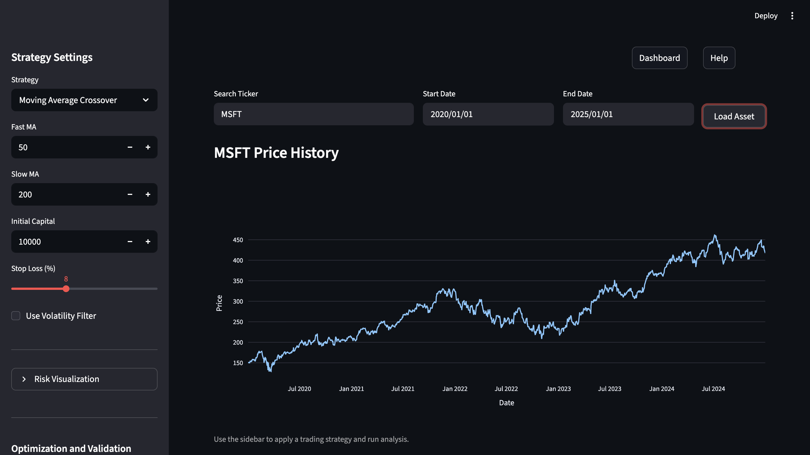
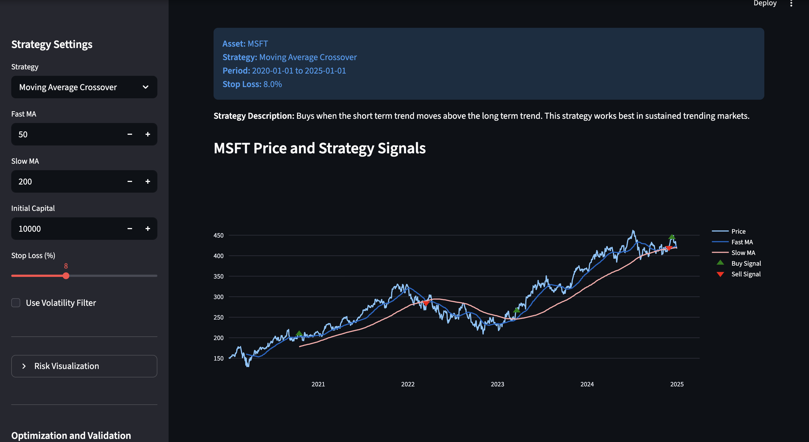
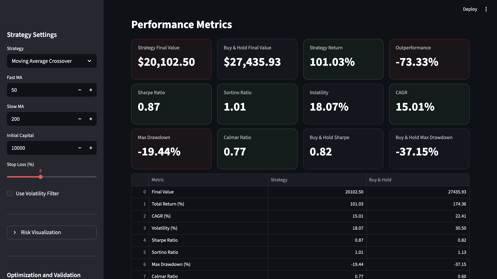
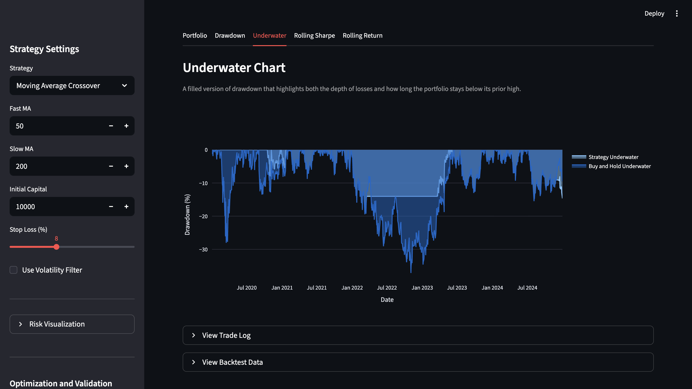

# Investment Analytics Platform

This README was generated on 2026-03-17 by Aryan Dhillon

---

# GENERAL INFORMATION

## Project Title
Investment Analytics Platform

## Author Information
Name: Aryan Dhillon  
Institution: Purdue University  
Major: Computer Engineering  
Minor: Business Economics

## Project Description
A full-stack trading strategy backtesting platform that allows users to analyze financial assets, test trading strategies, and evaluate performance using advanced metrics and visualizations.

---

# DEMO

### 1. Search and Load Asset

Search for any stock ticker, select a time range, and load price data to begin analysis.

---

### 2. Price History

Displays historical price data for the selected asset before applying any strategy.

---

### 3. Strategy Signals

Applies trading strategies and visualizes buy and sell signals based on market conditions.

---

### 4. Performance Metrics

Evaluates strategy performance using key metrics such as Sharpe ratio, CAGR, volatility, and drawdown, and compares results against a buy-and-hold benchmark.

---

### 5. Risk Analysis (Underwater Chart)

Visualizes drawdowns over time, showing how far the portfolio falls from its previous peak and how long it remains underwater.

---

### 6. Parameter Optimization and Validation

Optimizes strategy parameters on a training period and evaluates performance on out-of-sample data to reduce overfitting and improve robustness.

---

# SHARING / ACCESS INFORMATION

Repository:  
https://github.com/yourusername/investment-analytics-platform

Dependencies:
- Python 3.9+
- pandas
- numpy
- streamlit
- fastapi
- plotly
- requests

---

# PROJECT OVERVIEW

This project enables users to:

- Load historical price data for financial assets
- Apply trading strategies
- Evaluate performance vs buy-and-hold
- Analyze risk and return metrics
- Visualize results interactively
- Optimize parameters and validate strategies

---

# FEATURES

## Strategies
- Moving Average Crossover
- Momentum
- Mean Reversion

## Performance Metrics
- Total Return (%)
- CAGR
- Volatility
- Sharpe Ratio
- Sortino Ratio
- Max Drawdown
- Calmar Ratio

## Trade Statistics
- Number of trades
- Win rate
- Profit factor
- Average gain / loss
- Trade log with PnL and holding period

## Visualization
- Price chart with buy/sell signals
- Portfolio vs buy-and-hold
- Drawdown and underwater charts
- Rolling Sharpe ratio
- Rolling returns

## Advanced Capabilities
- Parameter optimization (train/test split)
- Walk-forward validation

---

# PROJECT STRUCTURE

iap_backend/  
- api/            FastAPI routes  
- strategies/     Trading strategies  
- analytics/      Metrics and trade statistics  
- engine/         Backtesting logic  

app.py            Streamlit frontend  

---

# METHODOLOGICAL INFORMATION

## Data Collection
- Market data is fetched via backend API (Yahoo Finance source)
- Data includes historical daily price information

## Data Processing
- Price data is converted into pandas DataFrames
- Strategies generate trading signals based on rules
- Backtester simulates trades using signals
- Metrics are calculated from portfolio value series

## Metrics Calculation
- Returns are computed using percentage change
- Volatility is annualized using 252 trading days
- Sharpe and Sortino use excess returns
- Drawdown is computed relative to running peak

## Software Requirements
- Python 3.9+
- pandas, numpy
- FastAPI (backend)
- Streamlit (frontend)
- Plotly (visualization)

---

# HOW TO RUN

## 1. Clone repository
git clone https://github.com/yourusername/investment-analytics-platform.git  
cd investment-analytics-platform  

## 2. Install dependencies
pip install -r requirements.txt  

## 3. Start backend
uvicorn iap_backend.main:app --reload  

## 4. Start frontend
streamlit run app.py  

## 5. Open in browser
http://localhost:8501  

---

# EXAMPLE USAGE

1. Enter a ticker (e.g., MSFT, AAPL, SPY)  
2. Select a date range  
3. Choose a trading strategy  
4. Run analysis  
5. Review:
   - Performance metrics  
   - Trade statistics  
   - Charts and visualizations  

---

# FUTURE IMPROVEMENTS

- Add additional strategies 
- Multi-asset portfolio support  
- Live trading integration  
- Cloud deployment (AWS)  

---

# NOTES

- Assumes 252 trading days per year  
- All returns are percentage-based  