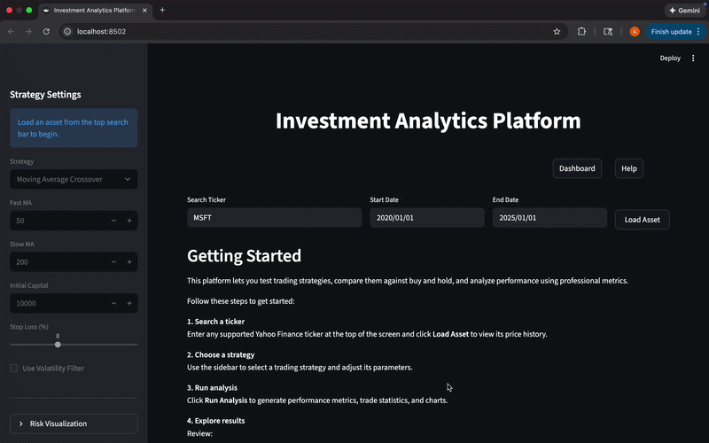
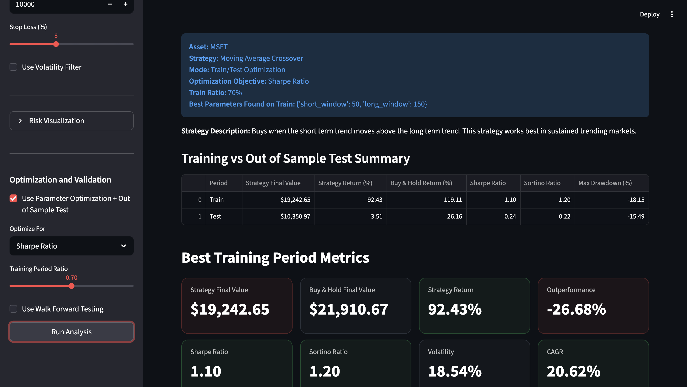

# Investment Analytics Platform


Full-stack trading strategy backtesting platform for evaluating and optimizing algorithmic trading strategies on historical market data.

Users can simulate trades, compare strategies against buy-and-hold, and analyze performance using advanced risk metrics such as Sharpe ratio, volatility, and drawdown.

---

## Key Highlights

- Built a full-stack trading platform using FastAPI (backend) and Streamlit (frontend)
- Implemented multiple trading strategies (momentum, mean reversion, moving averages)
- Designed a custom backtesting engine with trade simulation and portfolio tracking
- Computed advanced risk metrics (Sharpe, Sortino, drawdown, CAGR)
- Added parameter optimization and walk-forward validation to reduce overfitting
- Visualized performance with interactive Plotly dashboards

---

## Tech Stack

- **Frontend:** Streamlit  
- **Backend:** FastAPI  
- **Data Processing:** pandas, numpy  
- **Visualization:** Plotly  
- **Data Source:** Yahoo Finance API  

---

## Demo

Interactive demo of the platform, showing asset search, strategy execution, performance metrics, and risk analysis.



---

### Optimization and Validation


Optimizes strategy parameters on training data and evaluates performance on out-of-sample data to improve robustness.

---


## Architecture

```text
Frontend (Streamlit)
        ↓
Backend API (FastAPI)
        ↓
Data Layer (Yahoo Finance API)
        ↓
Backtesting Engine + Analytics
```

The backtesting engine, strategy logic, and analytics pipeline were implemented from scratch in Python.

---

## Project Overview

The platform allows users to:

- Load historical price data for financial assets
- Apply trading strategies
- Evaluate performance vs buy-and-hold
- Analyze risk and return metrics
- Visualize results interactively
- Optimize parameters and validate strategies

---

## Features

### Strategies
- Moving Average Crossover  
- Momentum  
- Mean Reversion  

### Performance Metrics
- Total Return (%)
- CAGR
- Volatility
- Sharpe Ratio
- Sortino Ratio
- Max Drawdown
- Calmar Ratio  

### Trade Statistics
- Number of trades  
- Win rate  
- Profit factor  
- Average gain / loss  
- Trade log with PnL and holding period  

### Visualization
- Price chart with buy/sell signals  
- Portfolio vs buy-and-hold  
- Drawdown and underwater charts  
- Rolling Sharpe ratio  
- Rolling returns  

### Advanced Capabilities
- Parameter optimization (train/test split)  
- Walk-forward validation  

---

## Use Cases

- Algorithmic trading research  
- Strategy validation and backtesting  
- Risk analysis and portfolio evaluation  
- Educational tool for quantitative finance concepts  

---

## Project Structure

```text
iap_backend/
├── api/ # FastAPI routes
├── strategies/ # Trading strategies
├── analytics/ # Metrics and trade statistics
├── engine/ # Backtesting logic

app.py # Streamlit frontend
```

---

## Methodology

### Data Collection
- Market data fetched via backend API (Yahoo Finance)
- Historical daily price data used for analysis

### Data Processing
- Price data stored in pandas DataFrames  
- Strategies generate trading signals  
- Backtester simulates trades  
- Portfolio values tracked over time  

### Metrics Calculation
- Returns computed using percentage change  
- Volatility annualized using 252 trading days  
- Sharpe and Sortino based on excess returns  
- Drawdown calculated relative to running peak  

---

## Requirements

- Python 3.9+
- pandas
- numpy
- streamlit
- fastapi
- plotly
- requests

---

## How to Run

### 1. Clone repository

```bash
git clone https://github.com/aryan0dhi/investment-analytics-platform.git

cd investment-analytics-platform
```

### 2. Install dependencies

```bash
pip install -r requirements.txt
```

### 3. Start backend

```bash
uvicorn iap_backend.main:app --reload
```

### 4. Start frontend

```bash
streamlit run app.py
```

### 5. Open in browser

```text
http://localhost:8501
```

---

## Example Usage

1. Enter a ticker (e.g., MSFT, AAPL, SPY)  
2. Select a date range  
3. Choose a trading strategy  
4. Run analysis  
5. Review:
   - Performance metrics  
   - Trade statistics  
   - Charts and visualizations  

---

## Limitations

- Does not account for transaction costs or slippage  
- Assumes perfect execution at closing prices  
- Strategies are rule-based and not adaptive to regime changes  
- No live trading or real-time data integration  

---

## Future Improvements

- Add additional strategies  
- Multi-asset portfolio support  
- Live trading integration  
- Cloud deployment (AWS)  

---

## Notes

- Assumes 252 trading days per year  
- All returns are percentage-based  